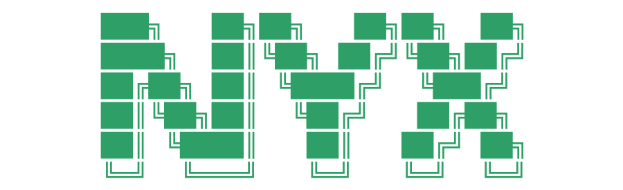
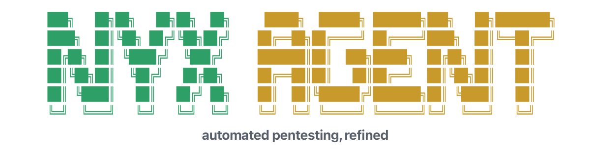
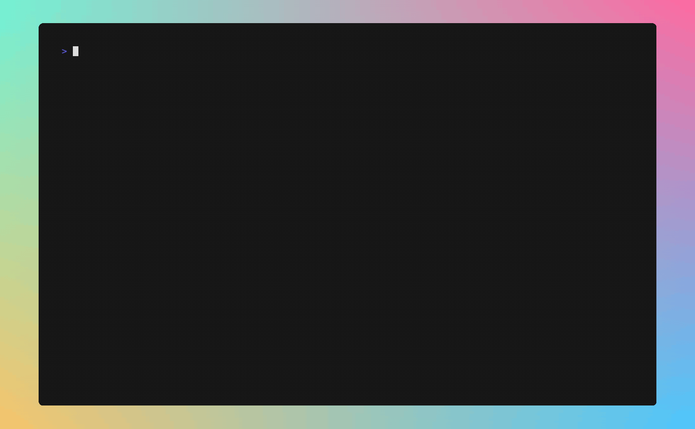
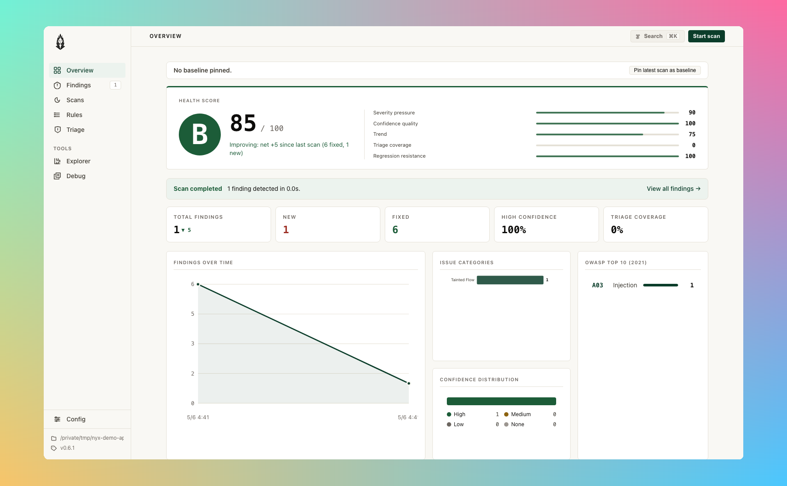
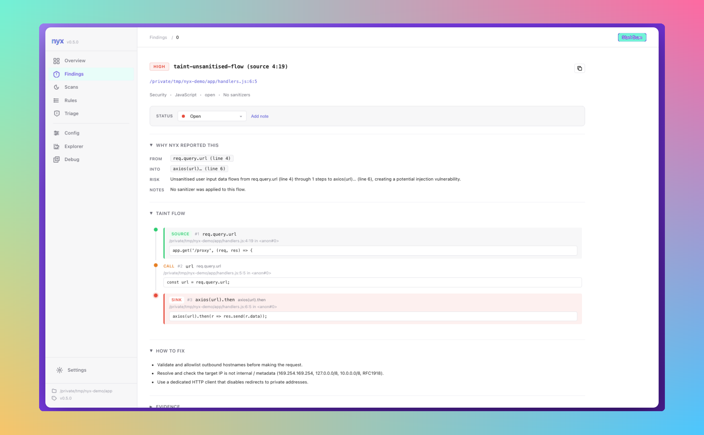
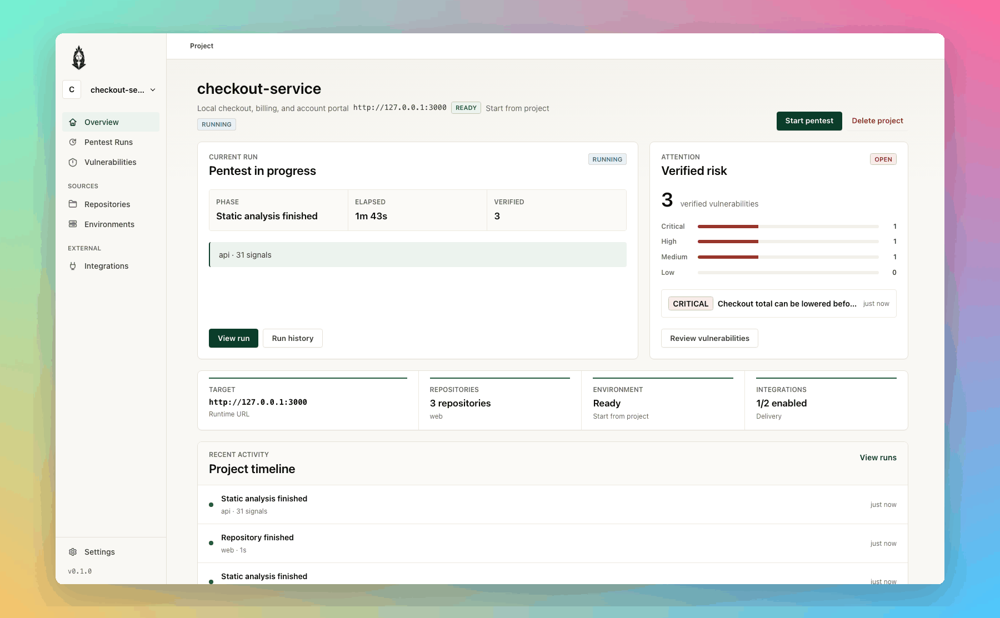
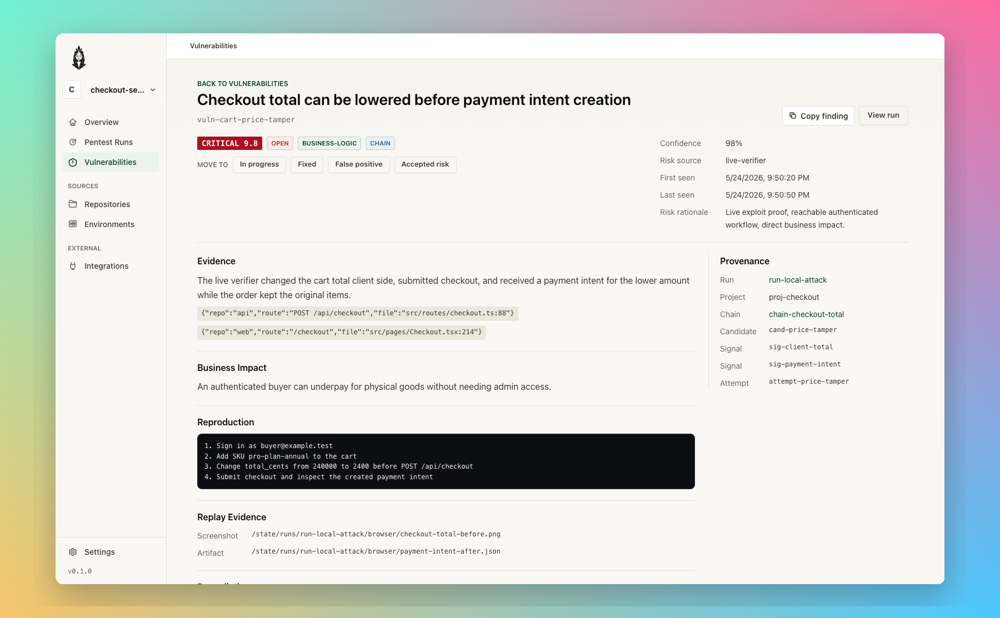
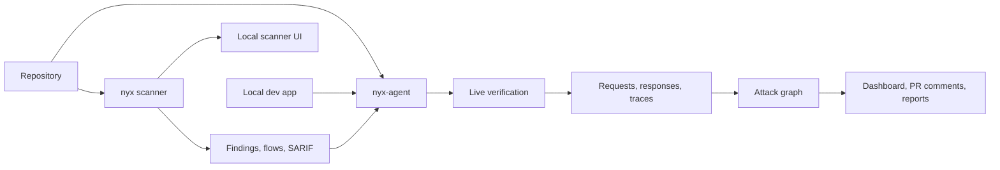

<div align="center">
  

  <h1>Nyx</h1>

  <p><strong>Local security tooling for source review, live testing, and proof you can inspect.</strong></p>

  <p>
    <a href="https://nyxsec.dev">Website</a> |
    <a href="https://nyxsec.dev/docs/">Docs</a> |
    <a href="https://nyxsec.dev/scanner">Scanner</a> |
    <a href="https://nyxsec.dev/agent">Agent</a>
  </p>
</div>

Nyx is a security stack for people who would rather keep the code close. The scanner reads your repository and explains source-to-sink paths. The agent sits above it, runs against a development app you control, and keeps the evidence: requests, responses, traces, run history, and triage.

The goal is simple: less noise, more proof, and no hosted service between your code and your security workflow.

## Projects

| [Nyx Scanner](https://github.com/nyx-sec/nyx) | [Nyx Agent](https://github.com/nyx-sec/nyx-agent) |
|---|---|
|  |  |
| Deterministic, local-first SAST written in Rust. It parses ten languages with tree-sitter, builds CFG and SSA, runs cross-file taint, ranks findings, and serves a local browser UI for review. | A local pentest workspace around `nyx`. It starts or watches a dev app, maps routes and auth shape, turns scanner signals into candidates, verifies them live, and stores proof in a local product database. |
| `cargo install nyx-scanner` | Packaging is still moving. Build from source today with `cargo build --workspace`. |

## Scanner

`nyx` is for the first pass through a codebase: fast enough for local use, strict enough for CI, and explicit about how each finding was reached.

<p align="center">
  
</p>

What it is good at:

- Cross-file source-to-sink taint analysis with per-function summaries.
- CFG, SSA, abstract interpretation, context-sensitive inlining, and opt-in deeper symbolic paths.
- SARIF, JSON, and console output for CI.
- A loopback-only browser UI with findings, scan history, rule views, config editing, explorer, and shared triage state.
- Rule coverage for SQL injection, XSS, command execution, SSRF, path traversal, deserialization, open redirect, header injection, SSTI, XPath, LDAP, prototype pollution, data exfiltration, auth gaps, state misuse, and more.

<p align="center">
  
  
</p>

## Agent

`nyx-agent` is for the part static scanners do not close on their own: checking whether a lead behaves like a real bug in a running app.

<p align="center">
  
</p>

What it adds:

- Project and repo inventory for multi-repo products.
- Launch profiles for build, start, health, seed, login, reset, and stop commands.
- Route, form, auth, API, role, object, and service context from code and runtime signals.
- Live verification with request and response evidence, browser traces, replay artifacts, and confidence.
- Business-logic templates for tenant isolation, object ownership, invite reuse, webhook replay, checkout and entitlement drift, and workflow abuse.
- A run-scoped attack graph that ties routes, objects, roles, candidates, attempts, verified vulnerabilities, and chains together.
- Optional model runtimes using BYOK or local adapters. The agent can run with model features disabled, with a local OpenAI-compatible endpoint, or through CLI tools you already installed. Nyx Agent does not include or resell model access.

<p align="center">
  
</p>

## How the Pieces Fit



## Quick Start

Scanner:

```bash
cargo install nyx-scanner
nyx scan --format sarif --fail-on MEDIUM > results.sarif
nyx serve
```

Agent:

```bash
cargo build --workspace
cargo run --bin nyx-agent -- doctor
cargo run --bin nyx-agent -- serve
```

## Notes We Care About

- Local by default: loopback binds, local state, no required account, no source upload.
- Evidence over volume: a finding should carry the path, code context, and proof level that made it worth showing.
- Useful in CI: SARIF for scanner runs, JSON reports and PR comments for agent runs.
- Honest boundaries: some checks are static, some are live, and destructive agent modes are for owned disposable development targets.

## Links

- Site: [nyxsec.dev](https://nyxsec.dev)
- Scanner docs: [nyxsec.dev/docs/nyx](https://nyxsec.dev/docs/nyx/)
- Agent docs: [nyxsec.dev/docs/agent](https://nyxsec.dev/docs/agent/)
- News: [nyxsec.dev/news](https://nyxsec.dev/news/)
- Commercial support and licensing: [contact@nyxsec.dev](mailto:contact@nyxsec.dev)
